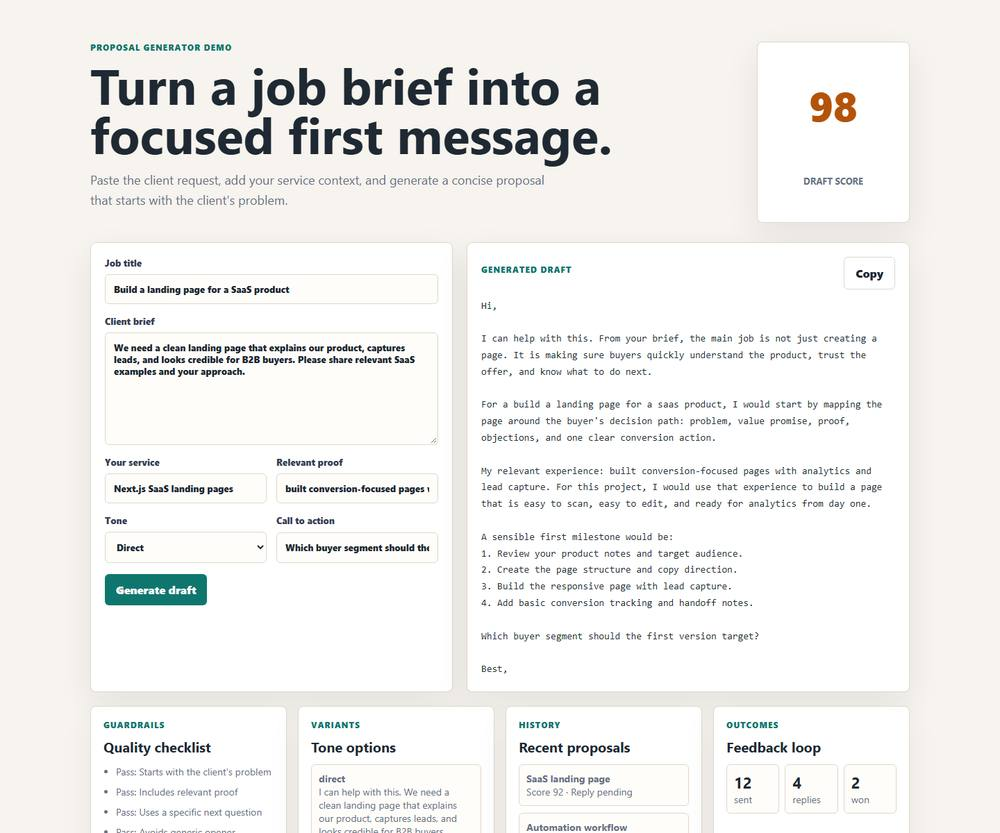

# Upwork Proposal Generator AI

An open-source, portfolio-ready **AI Upwork proposal generator** for freelancers, agencies, and SaaS builders who want to turn a job brief into a clear client-first proposal.

This repository is intentionally clean and generic. It is not connected to any private production product, private database, payment account, or internal system.

## Preview



## Feature Coverage

- AI-style Upwork proposal generator UI
- Job title, client brief, service, proof, tone, and call-to-action inputs
- Client-first proposal structure
- Proposal score and quality checklist
- Proposal variants for direct, consultative, and friendly tones
- Reusable freelancer profile context
- Mock usage quota
- Mock proposal history
- Mock outcome tracker
- Copy-to-clipboard action
- Proposal improvement notes
- Public-safe `.env.example`
- Local quality check for accidental secrets

## Screens Included

- Generator workspace
- Draft preview
- Quality score
- Guardrails checklist
- Variants panel
- Recent proposal history
- Outcome tracker
- Template library preview

## Need a Custom Version?

This template is a public demo. If you need a proposal generator for a real freelance team, agency, marketplace, sales workflow, or SaaS product, the same structure can be expanded into a production-ready tool.

Custom build options can include:

- User accounts and saved proposal history
- Real proposal scoring rules
- Custom proposal templates for your niche
- Client brief intake forms
- Team workspaces
- Usage limits and billing
- Admin review dashboard
- CRM or spreadsheet export
- API integration with your existing workflow

If you are planning a SaaS tool, client portal, proposal workflow, automation system, or dashboard product, connect with me on LinkedIn: [Yaver Abbas](https://www.linkedin.com/in/yawarak/).

## Related Open Source Templates

- [SaaS Member Dashboard Template](https://github.com/yaverabbas/saas-member-dashboard-template)
- [SaaS Admin Dashboard Template](https://github.com/yaverabbas/saas-admin-dashboard-template)

## Deployment Guide

This demo is static HTML, CSS, and JavaScript. You can deploy it almost anywhere.

### Option 1: GitHub Pages

1. Create a public GitHub repo.
2. Push this folder to the repo.
3. Open **Settings → Pages**.
4. Choose **Deploy from a branch**.
5. Select `main` and `/root`.
6. Save.

### Option 2: Netlify

1. Create a new Netlify site from GitHub.
2. Choose this repo.
3. Leave build command empty.
4. Set publish directory to `/`.
5. Deploy.

### Option 3: Vercel

1. Import the repo in Vercel.
2. Framework preset: **Other**.
3. Leave build command empty.
4. Output directory: `/`.
5. Deploy.

## Local Preview

Open `index.html` in a browser.

For a local server:

```bash
npx serve .
```

## Safety Check

Run:

```bash
node tools/quality-check.mjs
```

The check scans this repo for common secret patterns and accidental environment files.

## Suggested GitHub Description

AI Upwork proposal generator with scoring, tone variants, guardrails, proposal history, and a clean SaaS-style UI.

## Suggested Topics

`upwork`, `proposal-generator`, `ai-proposal-generator`, `freelancer-tools`, `saas`, `portfolio-project`, `javascript`
